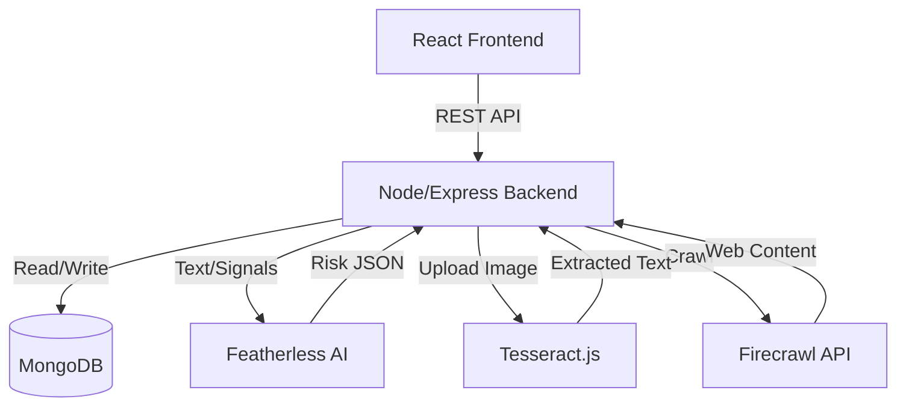

# ScamSaarthi 🛡️

**"Your AI companion for safer digital decisions."**

ScamSaarthi is an AI-powered digital safety platform designed to protect users from online scams by analyzing suspicious WhatsApp/SMS screenshots, emails, social media messages, job offers, payment requests, and URLs.

## Problem

Millions of people, especially students, parents, and first-time internet users, receive suspicious messages every day but don't know whether they are legitimate. Most people either ignore the message, ask someone else, or make a dangerous decision that could compromise their digital safety or finances.

## Solution

ScamSaarthi provides a safety layer between people and the internet. It lets anyone submit a suspicious message, screenshot, or URL and receive an understandable AI-powered risk assessment. It doesn't just detect scams; it explains **WHY** it's suspicious, **WHAT** it is, and **WHAT NEXT** steps to take.

## Features

- **Message Analyzer**: Paste text for instant analysis.
- **Screenshot Analyzer (OCR)**: Upload WhatsApp/SMS screenshots to extract and analyze text.
- **URL Investigator**: Enter a URL to crawl and analyze the website for malicious intent.
- **Hybrid Risk Engine**: Combines deterministic rules (detecting OTP requests, urgency) with LLM reasoning.
- **Explain to My Parent**: A killer feature that translates complex technical threats into simple, parent-friendly Hindi warnings.
- **Family Safety Mode**: Add trusted family members to optionally share suspicious analyses.
- **Security Dashboard**: Track your scam history and risk metrics.
- **Demo Mode**: Instant one-click mock scenarios (Fake Job, Bank Phishing, Lottery Scam) for easy presentation.

## Architecture



## Tech Stack

- **Frontend**: React, Vite, Tailwind CSS (v4), React Router, Recharts, Lucide React
- **Backend**: Node.js, Express.js, MongoDB, Mongoose, JWT, bcrypt, Multer
- **External Integrations**: 
  - Featherless AI (Reasoning Engine)
  - Firecrawl API (URL Investigation)
  - Wolfram API stub (Risk computations)
  - Tesseract.js (Screenshot OCR)

## Installation

### Prerequisites
- Node.js (v18+)
- MongoDB (running locally or a MongoDB Atlas URI)

### Backend Setup
1. `cd server`
2. `npm install`
3. Create a `.env` file based on `.env.example`:
   ```env
   MONGO_URI=mongodb://localhost:27017/scamsaarthi
   JWT_SECRET=your_jwt_secret
   PORT=5000
   FEATHERLESS_API_KEY=your_key_here
   FIRECRAWL_API_KEY=your_key_here
   ```
4. `npm run dev`

### Frontend Setup
1. `cd client`
2. `npm install`
3. `npm run dev`

The frontend will be available at `http://localhost:5173` and backend at `http://localhost:5000`.

## API Documentation

- `POST /api/auth/register` - Register a user
- `POST /api/auth/login` - Login a user
- `GET /api/auth/me` - Get current user profile
- `POST /api/analyze/text` - Analyze plain text
- `POST /api/analyze/image` - Analyze uploaded screenshot
- `POST /api/analyze/url` - Analyze a URL
- `GET /api/dashboard/stats` - Get user analytics
- `GET /api/family` - Get family members
- `POST /api/family` - Add a family member
- `DELETE /api/family/:id` - Remove a family member

## Render Deployment

This project includes a `render.yaml` blueprint for Infrastructure as Code deployment on Render.
- `scamsaarthi-backend`: Node Web Service
- `scamsaarthi-frontend`: Static Site (Vite build)

## Future Scope

- Support for more Indian languages in "Explain to My Parent".
- Browser extension for real-time protection.
- WhatsApp Chatbot integration.
- Voice-based scam detection for fraudulent calls.
